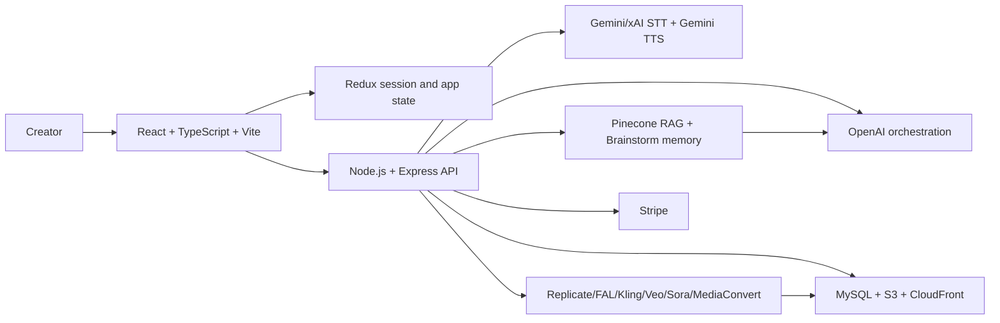

# ClikB

ClikB is an AI-driven media creation and social platform for turning a user instruction into short-form visuals, cinematic stories, interactive game scenes, voice-assisted ideation, and publishable social posts.

Live demo: [clikb.com](https://www.clikb.com)

This repository is a public portfolio version of ClikB, prepared to showcase the application architecture, AI workflows, RAG memory layer, full-stack implementation, and product thinking behind the app.

## What ClikB Does

ClikB is built around an instruction-to-media loop:

1. The user chooses a creation mode: Shorts/Memes, Cinema/Stories, or Games/Interactions.
2. The user gives a natural-language idea, prompt, or rough concept.
3. The backend expands it into structured plans, scene prompts, character/world context, image/video/audio prompts, and publish-ready metadata.
4. The user reviews, edits, regenerates, or refines the result through manual controls and AI editing tools.
5. Finished media can be published into feeds, profiles, and social discovery views.

The app is not just a passive generator. It keeps the creator in the loop with prompt editing, Storybook review, AI-assisted updates, RAG-backed Brainstorm help, voice interaction, and social publishing.

## Key Features

- Multi-mode content generation for Shorts/Memes, Cinema/Stories, and interactive Games/Interactions.
- Brainstorm assistant with typed chat, streaming replies, AI on/off control, web-search toggle, template saving, and RAG instruction injection.
- Full-app voice assistant with a floating voice circle, STT, spoken app context, interruption/barge-in behavior, and streaming TTS playback.
- RAG memory layer for app knowledge, user context, uploaded Brainstorm instructions, and dynamic prompt context injection.
- Storybook and EditStory workflow for reviewing scenes, editing generated prompts, adding B-shots, regenerating assets, and publishing final content.
- Media generation and processing routes for image, video, audio, thumbnails, upscaling, segmentation, prompt remixing, and cloud storage.
- Social layer with feeds, profile pages, follows, likes, search, and published post updates.
- Payments/pixels infrastructure for usage-based product mechanics.

## Architecture Overview



### Frontend

- `src/App.tsx` owns the top-level app shell, routing, providers, and major page surfaces.
- `src/PromptInput.tsx`, `src/Storybook.tsx`, and `src/EditStory.tsx` drive the main creation, review, and editing workflow.
- `src/components/PromptConstructor.tsx` and `src/components/BrainstormChat.tsx` provide the visible Brainstorm chat/template constructor experience.
- `src/components/GlobalBrainstormVoice.tsx`, `src/components/BrainstormSessionProvider.tsx`, and `src/hooks/useGeminiVoice.ts` provide the full-app voice assistant and shared Brainstorm session.
- Redux slices store app settings, profile state, and Brainstorm session state.

### Backend

- `server/src/server.ts` registers the Express API, auth/social routes, media routes, Brainstorm routes, RAG routes, Stripe routes, and static production serving.
- `server/src/GptApi.ts` contains the main AI orchestration for Brainstorm, generation planning, prompt editing, story/image/video prompt creation, template distillation, and mode-specific system prompts.
- `server/src/RagVectorService.ts` builds dynamic Brainstorm RAG context from Pinecone-backed knowledge and injects it into the Brainstorm system prompt.
- `server/src/PostDatabase.ts` handles database operations for posts, feeds, templates, follows, likes, worlds, characters, and RAG instruction metadata.
- `server/src/S3Routes.ts`, MediaConvert route files, Lambda FFmpeg routes, and provider route modules handle cloud media storage and processing.

## Brainstorm System

ClikB has two Brainstorm experiences that share the same product brain.

### Brainstorm Chat Mode

The visible chat lives inside the prompt/template constructor UI.

Main flow:

```text
PromptConstructor.tsx
-> BrainstormChat.tsx
-> POST /startBrainstormStream
-> GptBrainstormStream
-> RAG context injection
-> streamed assistant response
```

Important routes:

- `POST /startBrainstormStream` for streaming chat replies.
- `POST /startBrainstorm` as the non-streaming fallback and voice brain route.
- `POST /distillTemplate` for turning a Brainstorm result into a reusable template.
- `GET /get_rag_instructions`, `POST /upload_rag_instruction`, and `POST /delete_rag_instruction` for the RAG Injector.

### Full App Voice Mode

The floating voice assistant can operate outside the chat modal and receives spoken app context such as route, current user, prompt draft, art style, and selected model.

Main flow:

```text
Mic
-> useGeminiVoice.ts
-> STT provider
-> BrainstormSessionProvider.fullAppVoiceAsk
-> POST /startBrainstorm
-> POST /voiceTtsStream
-> audio playback
```

Voice/STT/TTS backend routes:

- `POST /liveToken` for Gemini Live token minting.
- `GET /sttProvider` to choose Gemini or xAI STT.
- `WS /xaiSttStream` for xAI/Grok STT proxying.
- `POST /voiceTtsStream` for Gemini TTS streaming playback.

## AI And RAG Workflows

- Brainstorm mode mapping in `server/src/GptApi.ts`:
  - `0` = Creative Scenes / Memes / Shorts
  - `1` = Cinema / Story
  - `3` = Interactive / Games
- Base RAG knowledge lives in `docs/rag-base-knowledge/` and documents app sections, route behavior, creation modes, feeds, profiles, and the Brainstorm bridge.
- Dynamic Brainstorm RAG memory is assembled by `server/src/RagVectorService.ts` and passed into the system prompt.
- User-uploaded RAG instructions are saved through database and S3-backed routes.
- Brainstorm sessions keep chat history, memory slots, selected voice, and user snapshot context in a shared session provider.

## Tech Stack

- Frontend: React, TypeScript, Vite, Material UI, Redux Toolkit, React Router, Framer Motion.
- Backend: Node.js, Express, TypeScript, dotenv, cookie-parser, CORS.
- AI orchestration: OpenAI, Gemini Live/TTS, xAI STT option, Replicate, FAL, model-specific prompt pipelines.
- RAG and memory: Pinecone, OpenAI embeddings, app knowledge chunks, Brainstorm memory slots.
- Media/cloud: AWS S3, CloudFront, MediaConvert, Lambda FFmpeg, signed upload/delete URLs.
- Data and product: MySQL, JWT auth, Stripe checkout/webhooks, social feed/profile/follow/like tables.
- Delivery: Dockerfile present for container builds, with runtime secrets expected from environment variables or a secret manager.

## Screenshots

Add current product screenshots here before sharing the repo on a CV. Existing UI assets in this repo:


## Local Setup

Prerequisites:

- Node.js 18+
- npm
- MySQL-compatible database
- AWS account/buckets for media storage if testing full media upload flows
- API keys for the AI/media providers you want to enable locally

Install dependencies:

```bash
npm install
cd server
npm install
```

Create local env files from the examples:

```bash
cp .env.example .env
cp server/.env.example server/.env
```

Run the backend:

```bash
cd server
npm run dev
```

Run the frontend in another terminal:

```bash
npm run start:front
```

Set `VITE_CLIK_URL` to the backend URL used by the frontend, for example `http://localhost:8080` in local development.

## Environment Variables

Real secrets must stay out of git. Use `.env`, `server/.env`, Docker/hosting environment variables, or a managed secret store.

Important safety notes:

- Do not commit API keys, AWS keys, database passwords, JWT secrets, Stripe secrets, private IPs, production configs, logs, or user data.
- `VITE_*` variables are bundled into browser code by Vite. Treat them as public and do not put private provider secrets there for production.
- Keep `.env.example` and `server/.env.example` placeholder-only.

## Recruiter Highlights

- Designed and implemented a full-stack AI media platform with multiple creation modes instead of a single prompt box.
- Built a mode-aware Brainstorm assistant that supports typed chat, streaming responses, template distillation, RAG injection, and voice control.
- Integrated RAG workflows for app knowledge and Brainstorm memory so the assistant can reason with product context.
- Orchestrated multiple AI/media providers behind a Node/Express API for image, video, audio, segmentation, upscaling, and prompt workflows.
- Built a human-in-the-loop creation pipeline with review, editing, regeneration, publishing, and social discovery.
- Connected product infrastructure including auth, feeds, follows, likes, profile pages, usage/pixels, Stripe, S3, CloudFront, and MediaConvert.

## Repository Note

This public repository is intended as a portfolio mirror of ClikB. It focuses on showing architecture, implementation scope, and AI workflow design rather than preserving every private development checkpoint or temporary local save.
